# Document Image Classification
Document image classification involves the application of deep learning techniques to automatically categorize documents based on their visual content. This process enables automation of document sorting, organization, and retrieval tasks, offering significant efficiency gains in various industries, including finance, healthcare, and administration.

## Dataset
For this project, dataset of Nepali document images from social media platforms were collected. The images belong to four distinct categories:

* Citizenship Card
* Driving Licenses
* Passport
* Others
    * This category includes all document images that don't fall into the above three categories.

**Sample Images**  
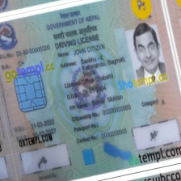  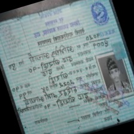 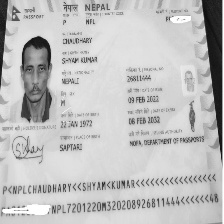  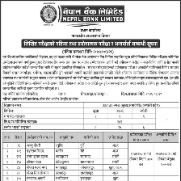
## Image Preprocessing
 The following pre-processing steps were used:
 1. Image Augmentation
    Due to the smaller dataset size, data augmentation was performed to expand the size and diversity of the dataset to improve model performance.  

    *Transformations used for pre-augmentation*
        a. Random Flip (Horizontal and vertical)  
        b. Random rotation  
        c. Random Shear  
        d. Random brightness/contrast  
        d. Grayscale Conversion  
    Dataset size was doubled after pre-augmentation.

 2. Image Resizing
    All images were resized to size of 224x224.
 3. Normalization
    Images were normalized using Imagenet dataset statistics.

## Model Selection
The experiments were mainly focused on CNN architectures. Some of the best performing modela are summarized below.  
a. VGG16 with Imagenet Weights  
* Hyperparameters:  
    - Batch Size: 4  
    - Learning Rate: 1e-3  
    - Epochs: 50

* Results:  
    * Train Set
        * Accuracy: 1
        * Precision: 1
        * Recall: 1
        * F1-Score: 1
        * Confusion Matrix  
        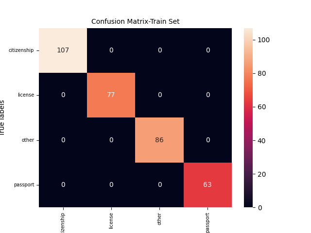
    * Validation Set
        * Accuracy: 0.779
        * Precision: 0.787
        * Recall: 0.772
        * F1-Score: 778
        * Confusion Matrix  
        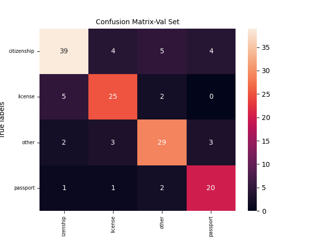
    * Learning Curves
        - Train vs Validation Accuracy  
        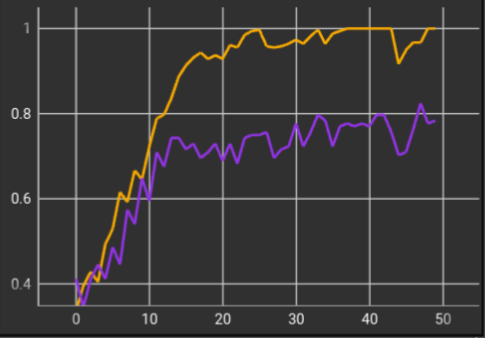
        - Train vs Validation Loss  
        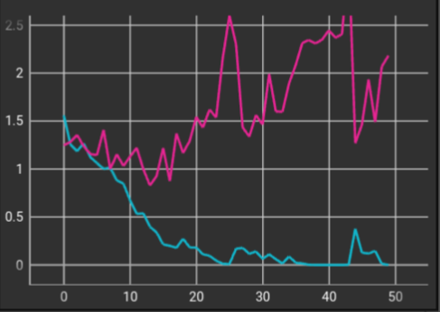

    We can see, though the train and validation accuracies  are converging, the loss shows clear overfitting. In the next experiment, we will try with more simpler models.
b. Resnet18 with Imagenet Weights  
* Hyperparameters:  
    - Batch Size: 4  
    - Initial Learning Rate: 1e-2
    - Learning Rate Schedular: Linear  
    - Epochs: 50

* Results:  
    * Train Set
        * Accuracy: 0.997
        * Precision: 0.997
        * Recall: 0.996
        * F1-Score: 0.996
        * Confusion Matrix  
        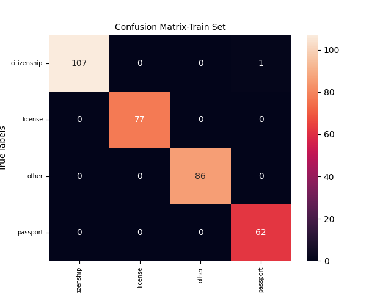
    * Validation Set
        * Accuracy: 0.958
        * Precision: 0.968
        * Recall: 0.958
        * F1-Score: 0.962
        * Confusion Matrix  
        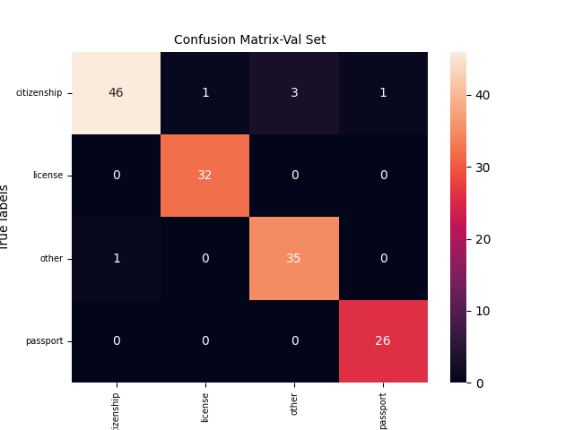
    * Learning Curves
        - Train vs Validation Accuracy  
        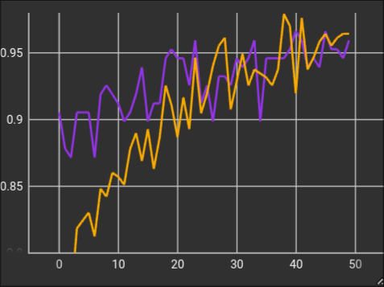
        - Train vs Validation Loss  
        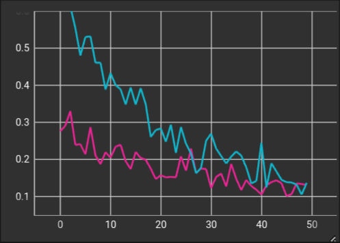