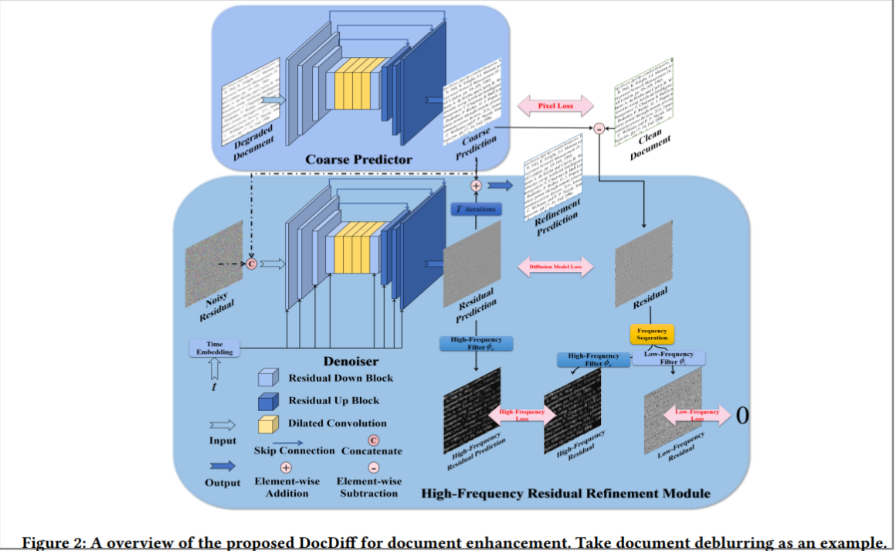
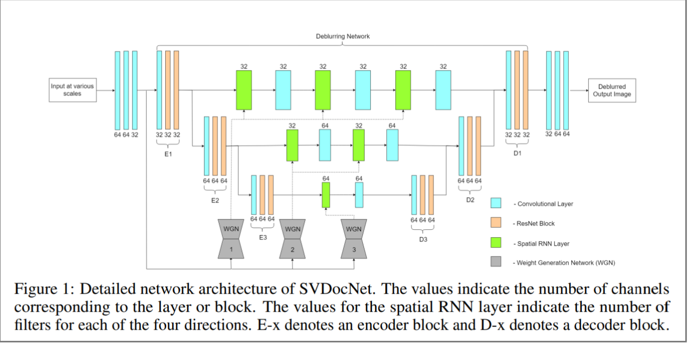

# Document Image Processing
Reference:
* https://github.com/ZZZHANG-jx/Recommendations-Document-Image-Processing?tab=readme-ov-file#1-appearance-enhancement

1. Deblurring  
 Traditional methods rely on complex blur kernel assessment, while deep learning methods have recently shown promising results. Some papers on deep learning based deblurring:  
    a. [An Image Deblurring Method Using Improved U-Net Model](https://www.hindawi.com/journals/misy/2022/6394788/)  
    The proposed model includes depth-wise separable convolution, residual depth-wise separable convolution, wavelet transform, and a DMRFC module.The method aims to improve the deblurring effect, reduce computational burden, and provide a more lightweight image deblurring method.

    b. [DocDiff: Document Enhancement via Residual Diffusion Models](https://arxiv.org/pdf/2305.03892)  
    DocDiff, a diffusion-based framework for document enhancement, specifically designed for tasks like document deblurring, denoising, and watermark/seal removal.  DocDiff consists of two modules: the Coarse Predictor (CP) for low-frequency content recovery, and the High-Frequency Residual Refinement (HRR) module for predicting high-frequency information (text edges).The HRR module is a plug-and-play component in pre-trained DocDiff, which significantly sharpens text edges in SOTA deblurring methods without additional joint training. The paper discusses the challenges in document enhancement, including noise elimination and pixel-level text generation with low latency on high-resolution document images.
    

    c. [SVDocNet: Spatially Variant U-Net for Blind
Document Deblurring](https://openreview.net/pdf?id=Hyx3f65qLS)  
    SVDocNet, a spatially variant U-Net for blind document deblurring, which is an end-to-end trainable network consisting of recurrent layers in the skip connections.The network is motivated by the fact that conventional CNNs may require a large number of parameters and complex architecture for image deblurring due to the large receptive field of the inverse filter. The proposed SVDocNet uses a spatially variant RNN to efficiently cover a large receptive field with minimal network parameters, reducing computation cost.
    

2. Resolution Imrpvement  
    Image upscaling and interpolation are both techniques used to increase the resolution of an image, but they operate in different ways and have different effects.
    * **Interpolation** is a method used to estimate values of pixels at non-integer coordinates based on the values of surrounding pixels.Common interpolation methods include nearest-neighbor, bilinear, bicubic, and Lanczos interpolation. Interpolation is quick and easy to implement but may result in blurry or pixelated images, especially when upscaling by large factors.
    * Image upscaling refers to increasing the size of an image while preserving its quality as much as possible. Unlike interpolation, image upscaling often involves more complex algorithms that take into account the content and structure of the image.
    Common upscaling methods include bicubic interpolation, super-resolution algorithms (such as SRGAN), deep learning-based approaches (like ESRGAN), and other techniques that aim to generate high-quality, realistic details in the upscaled image.
